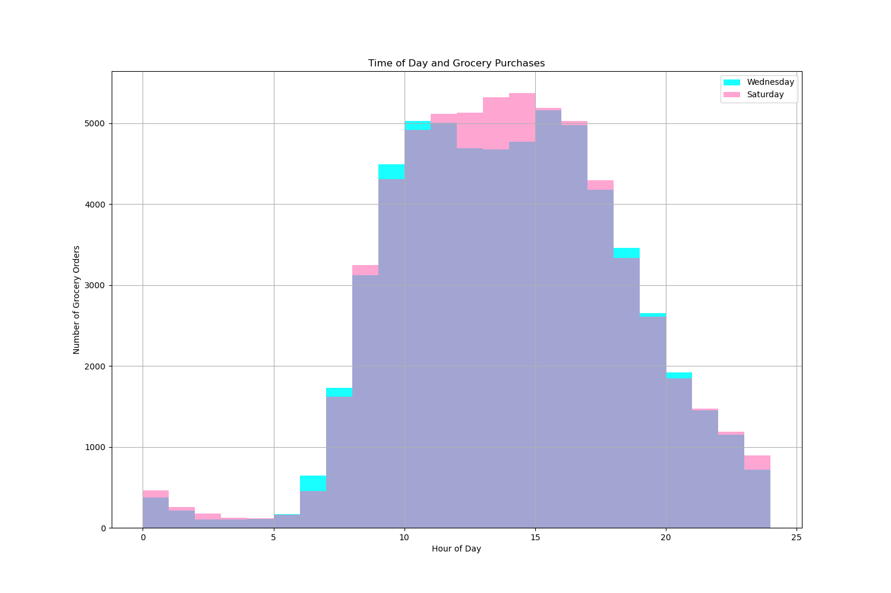
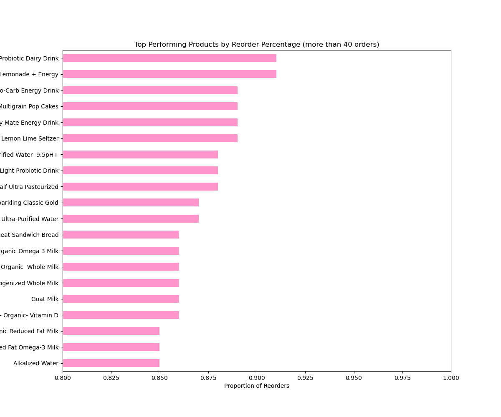
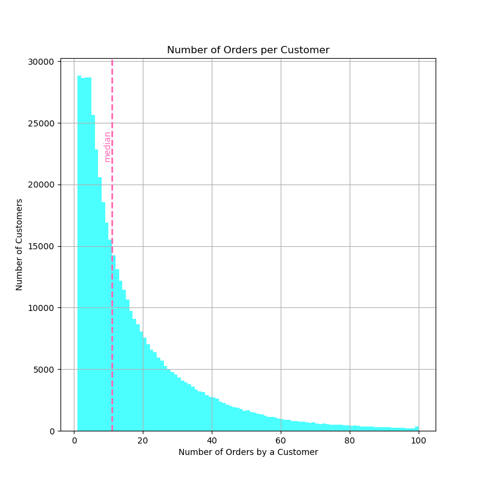

# Project

The full prject can be found [here](instacart.ipynb)

# Introduction

Instacart, a grocery delivery company, requests insight into the shopping habits of their customers. Data is provided which they hope will uncover important answers about customers product preferences and usage habits.

# Key Findings

Top selling products include generic fruit and vegetable products as well as milk. Bananas and organic bananas reign supreme and account for over 110,000 orders. 

Reorder rates show differences among top products. The highest include bananas 

Differences between customer usage on weekdays and weekends are minimal. This is shown by the relationship between usage on Wednesday's and Saturday's. 

They  follow similar shopping patterns. Slight differences occurs at 7:00 am where Wednesday has more orders. Shopping picks up quickly, seeing increases of around 1000 orders per hour until 10:00 am. At around 12:00pm, Saturday shopping increases more than Wednesday's. 

Both peak over 5000 orders at around 2:00pm and 3:00pm. After this point, shopping sees a more gradual decrease than it's morning increase.

Foods with the highest reorder proportions are mostly drinks. These include probiotics, energy drinks, milk, soda water and purified water. 

These products could be a good fit for future advertisement as they show that they have been liked by customers more than other products. Interestingly, these items show a longer shelf life than current top sellers.

The distribution is right skewed with the highest frequency of customers (28000) having only one order. 

This hovers before dropping rapidly at five orders. This suggests that many customers have only used instacart a handful of times. However, more than half of customers have made over 10 orders using instacart.

Many have used it hundreds of times, suggesting that there is potential for first time users. 