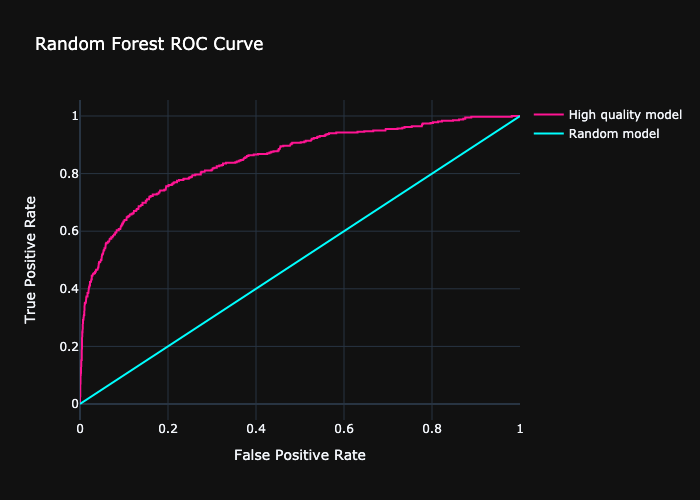
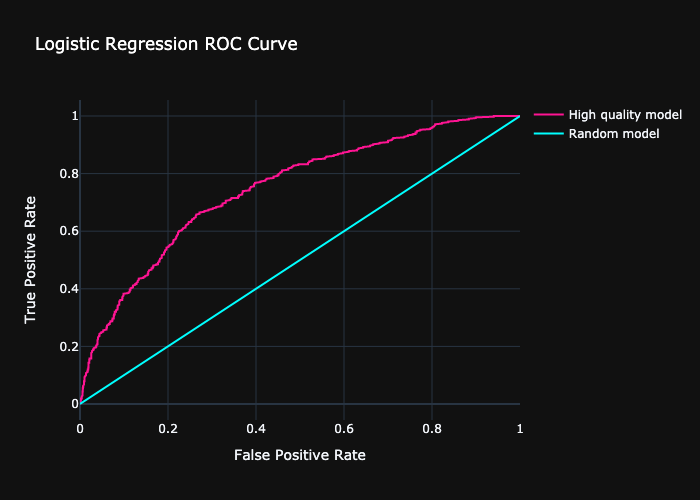

# Beta Bank Customer Retention Model

Check out the full notebook [here](betabank-ml.ipynb)

## The Problem
Beta Bank customers are leaving little by little each month. The bank determined it's cheaper to save existing customers than to attract new ones. Knowing which customers will leave soon would be a valuable tool to help Beta Bank target the right customers before they decide to leave.

## Purpose
Beta Bank hopes a sufficent prediction model can be made. It's sufficiency depends if a an F1 score of at least 0.59 is attained. The AUR-ROC metric will also be compared. Client behaviour including whether they have terminated their contract or not has been provided.

## Data Description

Data has been provided by TripleTen. 

## The Process
The process will follow these four steps:

- Prepare the data

- Examine the balance of classes

- Test models without improvements
    - Random Forest
    - Logistic Regression

- Improve model quality
    - Upscaling
    - Downscaling
    - Threshold Adjustments
    - Class Weight Adjustments
- Perform final testing with choseon model and improvement method

## Key Findings

- Accuracy is not the best metric due to heavy class imbalance (80%-20% split of target)
- Upsampling with a random forest model produced the best F1 score of 62%
- AUC-ROC Curves confirmed random forest (0.852) was better than the logistic regression model (0.759)

