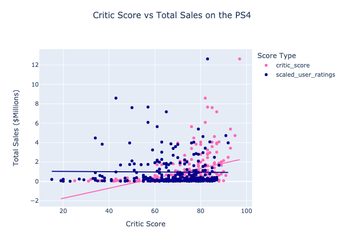
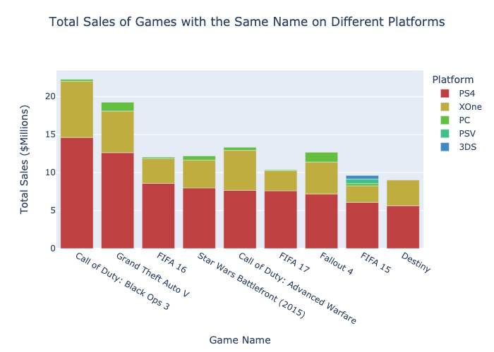
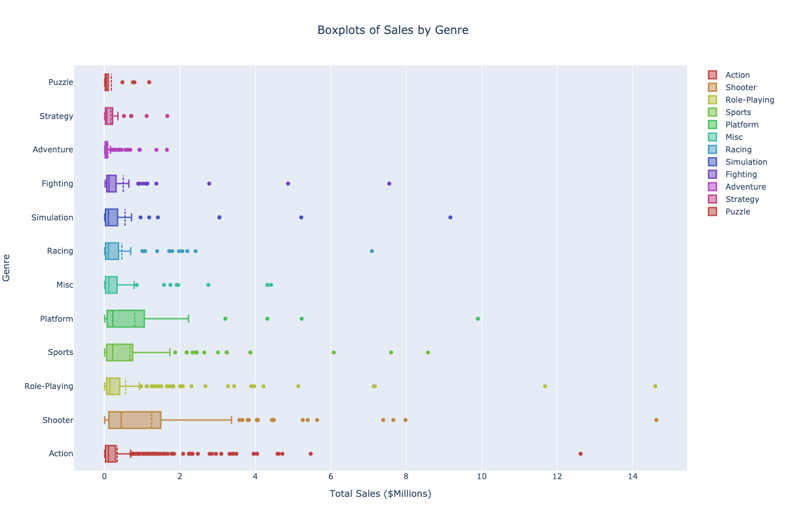
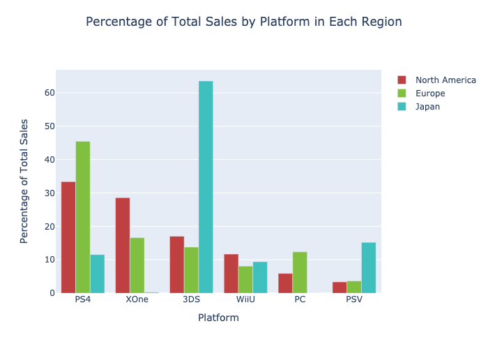
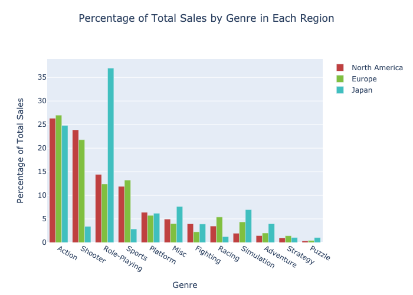
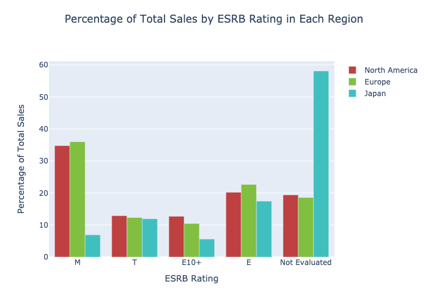

# Megaline (Statistical Data Analysis)
The loom overview can be found here and full python notebook project [here.](games.ipynb)

## Purpose
Ice, an online gaming store wishes to plan advertising campaigns in the best way possible. Historical game data has been provided to analyze the industry and identify patterns that will determine if a game will succeed or not. User and expert reviews, genres, platforms and game sale data has all been provided. 
 
## Data

Data has been provided by TripleTen and can be found [here](data/games.csv)

## Key Findings

### General Analysis
- Platforms typically show a 9-11 year life cycle
- Top current platforms are nearing the end of their lifecycle

- User scores are not correlated with game sales (-0.013)
- Critic scores show a weak positive correlation with game sales (0.405)

- The PS4 is dominating the market, even selling more games of the same title compared to other platforms

- Shooters, action and roleplaying genres are the most profitable

### User Profile by Region

- The two highest selling platforms in Europe and North America are the PS4 and Xbox One. They make up over 60% of the marketshare. This is different to Japan where the Nintendo 3DS consumes more than 63%.

- Japanese gamers may prefer more immersive experiences. Gamers in North America and Europe prefer action and shooter games.

- Europe and North American gamers are not effected by ratings with mature rated games taking up the majority of the marketshare. In Japan, the everbody category is the highest.

### 6.3 Hypotheses Tests
#### XBox One and PC Ratings

The hypothesis that average user ratings of the Xbox One and PC platforms are similar is supported. This indicates that platform may not play a big factor into the game that is advertised.

#### Action and Sports Ratings

The hypothesis that the average user ratings for action and sports genres are the same is unsupported. 

## Assumptions:

- User behavior will continue to behave as it has
- The sample data provided is a fair representation of the true population