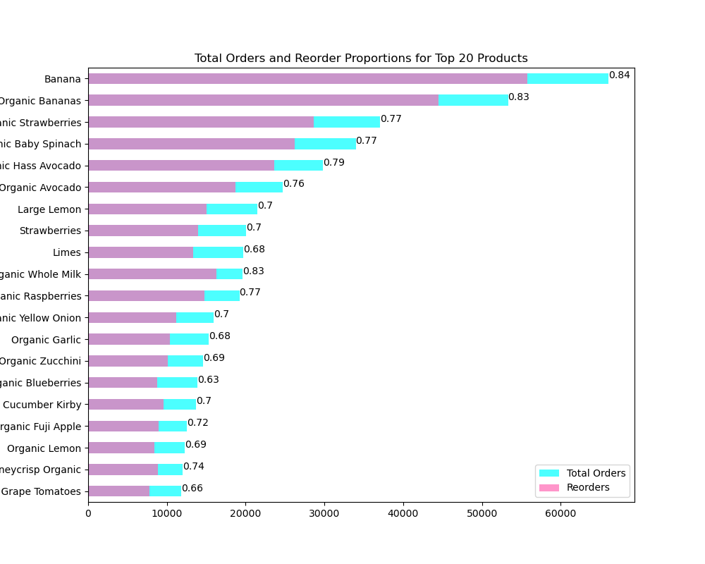
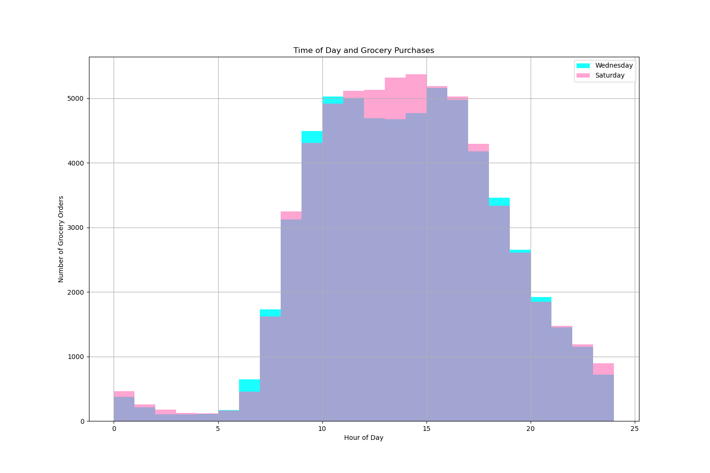
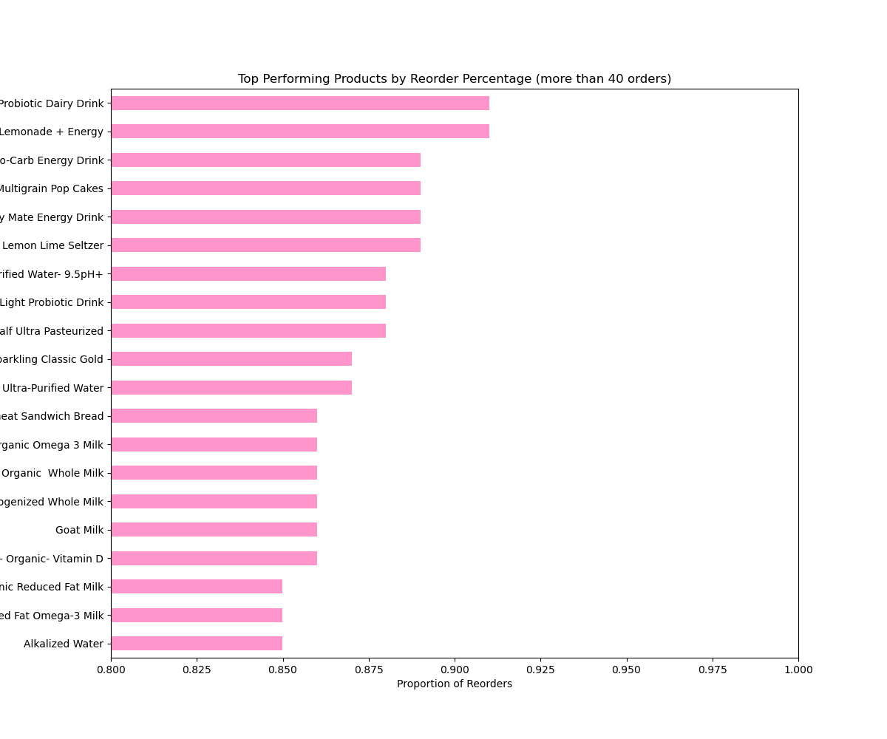
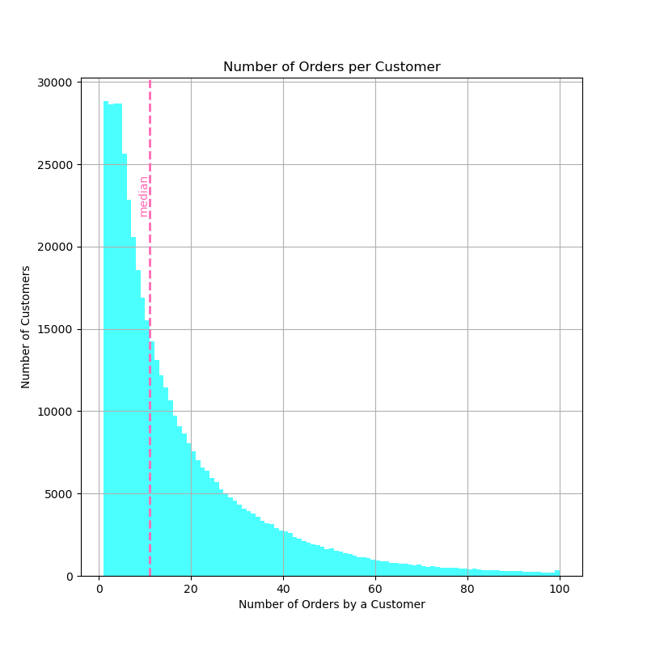

# Instacart (Exploratory Data Analysis)

The loom overview can be found here and the full python notebook project [here.](instacart.ipynb)

## Purpose

Instacart, a grocery delivery company, requests insight into the shopping habits of their customers. 

They wish to know:
- Which hours and days are most orders being processed?
- How frequently do customers place orders?
- Are customer habits different between weekends and weekdays?
- How many customers re-order and how often?
- What proportion of items are a re-order?
- What are the top products that are:
  - purchased?
  - re-ordered?
  - the first items customers buy?
 
## Data Description

Five tables have been provided by instacart (and sourced by TripleTen). Each will be preprocessed for data exploration. Below is a data dictionary that lists the columns in each table along with a description.

`instacart_orders.csv`: each row corresponds to one order on the Instacart app

- `'order_id'`: ID number that uniquely identifies each order
- `'user_id'`: ID number that uniquely identifies each customer account
- `'order_number'`: the number of times this customer has placed an order
- `'order_dow'`: day of the week that the order placed (which day is 0 is uncertain)
- `'order_hour_of_day'`: hour of the day that the order was placed
- `'days_since_prior_order'`: number of days since this customer placed their previous order
     
`products.csv`: each row corresponds to a unique product that customers can buy
- `'product_id'`: ID number that uniquely identifies each product
- `'product_name'`: name of the product
- `'aisle_id'`: ID number that uniquely identifies each grocery aisle category
- `'department_id'`: ID number that uniquely identifies each grocery department category

`order_products.csv`: each row corresponds to one item placed in an order
- `'order_id'`: ID number that uniquely identifies each order
- `'product_id'`: ID number that uniquely identifies each product
- `'add_to_cart_order'`: the sequential order in which each item was placed in the cart
- `'reordered'`: 0 if the customer has never ordered this product before, 1 if they have

`aisles.csv`
- `'aisle_id'`: ID number that uniquely identifies each grocery aisle category
- `'aisle'`: name of the aisle
    
`departments.csv`
- `'department_id'`: ID number that uniquely identifies each grocery department category
- `'department'`: name of the department

## Process

Data was first pre-processed. This included handling:
- duplicate values
- missing values
- odd values

Once data was cleaned, an analysis occurred that required:
- merging dataframes
- slicing dataframes
- grouping values

Visualisation of these results was shown to display key findings.

## Key Findings

Top selling products include generic fruit and vegetable products as well as milk. Bananas and organic bananas reign supreme and account for over 110,000 orders. 

Reorder rates show differences among top products. The highest include bananas 

Differences between customer usage on weekdays and weekends are minimal. This is shown by the relationship between usage on Wednesday's and Saturday's. 

They  follow similar shopping patterns. Slight differences occurs at 7:00 am where Wednesday has more orders. Shopping picks up quickly, seeing increases of around 1000 orders per hour until 10:00 am. At around 12:00pm, Saturday shopping increases more than Wednesday's. 

Both peak over 5000 orders at around 2:00pm and 3:00pm. After this point, shopping sees a more gradual decrease than it's morning increase.

Foods with the highest reorder proportions are mostly drinks. These include probiotics, energy drinks, milk, soda water and purified water. 

These products could be a good fit for future advertisement as they show that they have been liked by customers more than other products. Interestingly, these items show a longer shelf life than current top sellers.

The distribution is right skewed with the highest frequency of customers (28000) having only one order. 

This hovers before dropping rapidly at five orders. This suggests that many customers have only used instacart a handful of times. However, more than half of customers have made over 10 orders using instacart.

Many have used it hundreds of times, suggesting that there is potential for first time users. 