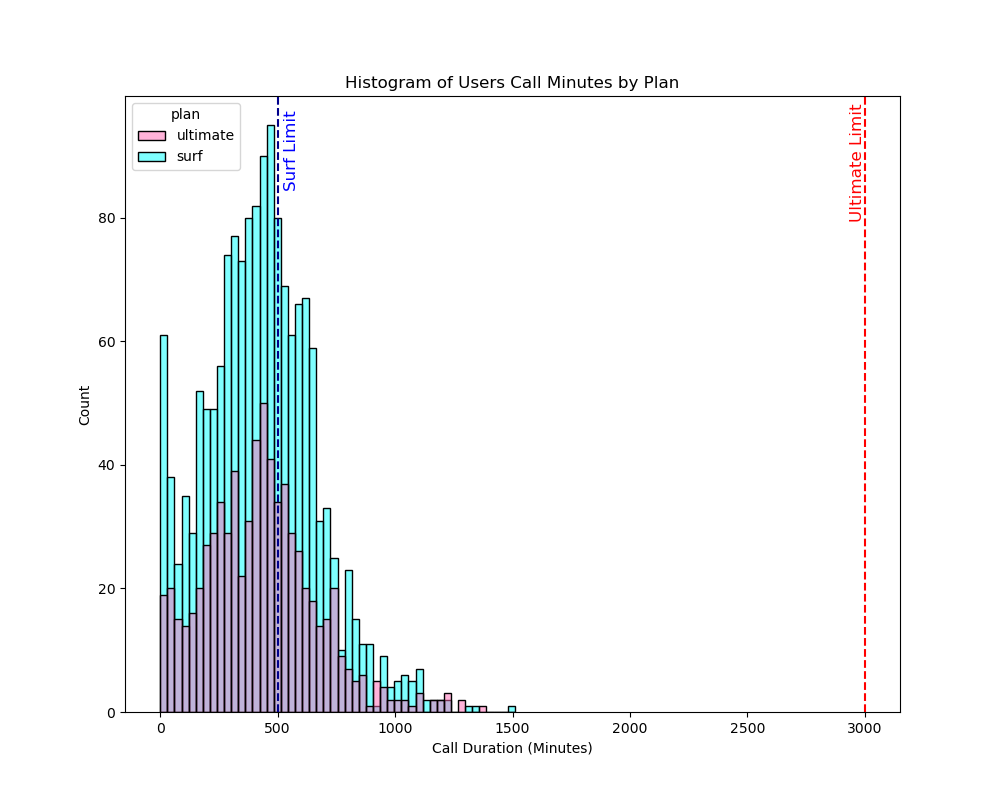

# Megaline (Statistical Data Analysis)
The loom overview can be found here and full python notebook project [here.](megaline-sda.ipynb)

## Purpose

Megaline, a phone company, seeks to find its most profitable phone plan so it can adjust its advertising budget accordingly. An analysis on where most of its profit comes from was also undertaken.

## Process

To determine which plan is better, a statistical analysis that uses a small sample of users will be used.  Hypotheses tests about profitability will be done to justify analytical findings.

To do this the following steps will take place:
1. Prepare data
2. Analyze revenue data 
3. Validate hypotheses 
 
## Data

5 datasets containing data for 500 users has been provided. These include user information, user calls, user messages, internet usage, and user plan. A more in depth description of the data has been provided in the [notebook](megaline-sda.ipynb).

## Key Findings

Revenue is dependent on a customer's:
- call duration
- number of messages sent
- internet usage

These three levers in the surf plan must overcome the price difference in the ultimate plan to be more profitable. As most ultimate plan users do not go over their high caps, this difference is 50 dollars.

### Call Duration

This histogram shows how similar the number of calls are between phone plans. Whilst there are more surf users, the distribution follows the same shape. Comparing summary statistics confirms that plan type does not affect the number of calls customers make. 25% of surf users do go over their plan limits, but not significanlty enough to overcome the fixed price difference between the plans alone. Even the most extreme caller only accounts for 30 dollars, which is still under the 50 dollar limit.

### Messages

Ultimate plan users are not paying extra for text messages whilst texting more. 25% of Surf plan users are paying, however, at 3 cents per message. This income is even smaller than what calling minutes are providing. For instance, even if all surf users were messaging as much as the highest messager, only 7 dollars would be added.

### Internet Usage

Whilst some ultimate users are paying for excess internet, almost half of surf users are. As the cost for an extra gigabyte is 7 dollars, this becomes a significant revenue source. 25 percent of surf users are paying atleast 50 dollars extra for internet alone. This in combination with call duration and message costs may be enough to make the surf plan more profitable so long as users continue to behave similarly. Likewise, if megaline wanted to increase profit, this would be the lever to use.

### Monthly Revenue

Average revenue from ultimate users has consistently outpaced that of surf users on a month to month basis. However, the gap has shrunk. In January, a mean difference of 50 dollars seperated the two plans, a number that has since significantly tightened to only a couple dollars in December. This has occured due to rises in mean revenue by surf users as ultimate revenue means have hovered around the 70 dollar mark.

On a revenue basis the ultimate plan provides more, but if trends continue this will change as surf users continue to exceed their plan limits.

### Hypothetical Tests

This final conclusion regarding revenue was supported through hypothesis testing which supports the notion that a difference between profitability exists not due to chance.

A sub hypothesis also tested if location impacted revenue. This was supported when looking at user revenue between customers in the New York area compared to all other customers.

## Assumptions:

- User behavior will continue to behave as it has.
- The sample data provided is a fair representation of the true population.