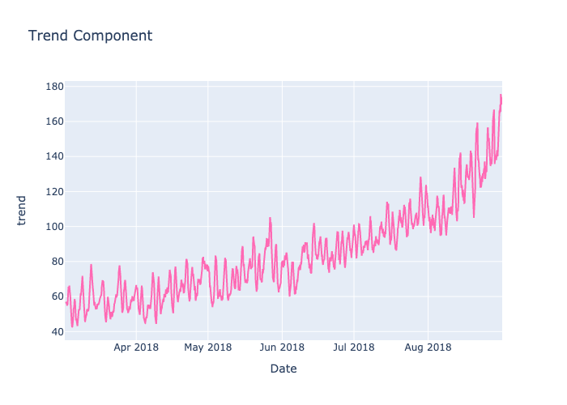
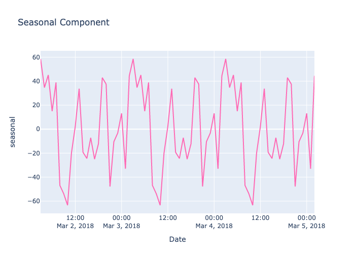

# Sweet Lift Taxi Company (Time Series Machine Learning)

The full project can be found [here](taxi-time.ipynb)

## Introduction

Sweet Lift Taxi Company wishes to attract more drivers during peak hours. They have offered historical data on taxi orders at airports to find a model that predicts the amount of taxi orders needed for the next hour.

## Goal

Find the best model that determines how many drivers are required for the next hour. This will be done by measuring the Root Mean Squared Error which shows how far predicted values deviate from the actual value on average.

## Process

### Prepare Data

- Resample and Clean
- Test Stationarity
    - Decomposition
    - Ad-Fuller Test
- Enrich Data
    - Add columns for lag, moving values

### Training
The data was trained on multiple models. These included:

- Linear Regression
- Random Forests
- Gradient Boosting
- SARIMAX

### Testing

Use the chosen model to predict values on the test set.

## Key Findings

### Data Preparation

The data showed signs of seasonality and trends, despite the ad-fuller test suggsting the data was stationary.

### Training

A baseline model that used previous values produced an RMSE of 46.82 on the training set. This was beaten by numerous models, however, overfitting occurred in the SARIMAX and Random Forest models. Instead, the linear regression model was chosen which produced am RMSE of 33.98 on the training set.

### Testing

The linear regression model returned an RMSE of 46.11 on the test set. This is slightly better than the RMSE of the previous values model on the validation set. Thus, it is difficult to say if the model is infact better than simply looking to previous values.