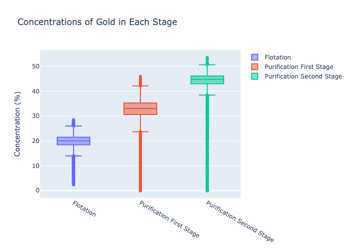
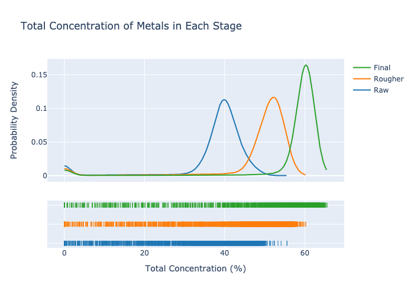

# Zyfra (Integrated Project 2)

## Introduction

Zyfra, a company that develops solutions for heavy industry equipment, seeks help. They are looking for a model that can predict how much gold can be produced from gold ore. Extraction and purification metrics have been provided in the hopes to optimize production and eliminate inefficent practices.

## Goal

Create a model that predicts gold concentration at the final stage of purification.

## Modeling Process

The model will be created in 3 steps:

1. Data Preparation
2. Data Analysis
3. Model Training and Development

## Data 

Data has been provided by TripleTen in 3 seperate files. A more thorough description is provided in the notebook.

## Findings

### Exploratory Data Analysis

- Gold concentration increased from 19.67% to 44.48% based on median average

- Total metal concentration increased by 20% throughout all stages

- Gold and lead concentrations increased throughout the extraction process, whereas silver decreased.

- The symmetric mean absolute percentage error was chosen as the metric used to measure optimization. Two functions were created to reflect this. Two models were then created and the random forest showed the most promise with the lowest sMAPE score. However, when applied to the train set, this model performed worse than dummy models which predicted the outcome based on averages.

Come back and finish with Gradient Boosting Model